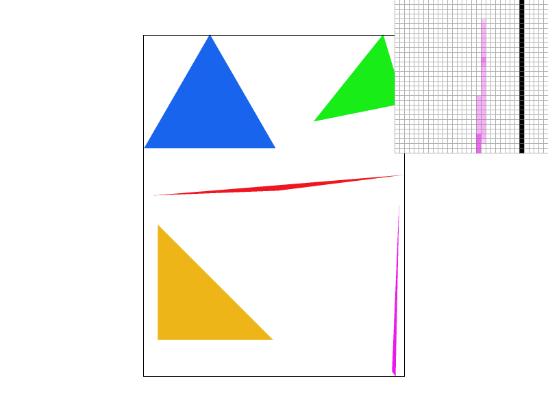

# CS 184/284A: Computer Graphics and Imaging, Spring 2024
# Homework 1: Rasterizer
## Edward Park

## Overview
Give a high-level overview of what you implemented in this homework Think about what you've built as a whole. Share your thoughts on what interesting things you've learned from completing the homework.

## Section I: Rasterization
### Part 1: Rasterizing single-color triangles

My process of rasterizing a triangle is as follows:
1. I perform a vector cross product to determine if the vertices are wound in a clockwise direction. If they are not, I swap 2 vertices to ensure that the triangle is wound clockwise.
2. I calculate a bounding rectangle of the triangle using the vertices.
3. I sample at the middle of each pixel inside the bounding rectangle. Using that point, I perform 3 line tests to see if the point is inside the triangle.
4. If the sample is in the triangle, I call `RasterizeImp::fill_pixel`, which fills the sample buffer with the corresponding color.

My algorithm is no worse than checking each sample within the bounding box of the triangle because that is exactly the algorithm I used -- so it should perform similarly.

Here are a few examples of the rendered images:
| File | Image |
|:---:|:---:|
| svg/basic/test4.svg |  |
| svg/basic/test5.svg |  |

#### Extra credit: Optimizations

#### Timing: Optimizations (average 10 times, ms)
| File | Naive | Factoring Redundant Arithmetic Operations |
|:---:|:---:|:---:| 
| svg/basic/test3.svg | 8.054 | 7.760 |
| svg/basic/test4.svg | 0.350 | 0.322 |
| svg/basic/test5.svg | 1.044 | 1.004 |
| svg/basic/test6.svg | 0.659 | 0.611 |

After performing an optimization for reducing the amount of redundant arithmetic operations, there was only marginal (< 10%) improvement.

### Part 2: Antialiasing triangles

Supersampling is a useful tool for antialiasing images. It allows us to reduce jaggies and other aliasing effects by computing an average of samples across a pixel, instead of using a single sample for each pixel. This leads to smoother edges, particularly for skinny and narrow triangles.

For supersampling, much of the rasterization process is the same. However, there are a few key differences:
- When sampling each pixel, I calculated a grid of `sample_rate` points to sample from. I had to add this to my sample buffer, instead of directly calling `RasterizeImp::fill_pixel`.
- I had to modify `RasterizeImp::fill_pixel` to fill the sample buffer with `sample_rate` copies of the provided color. This is so that points and lines would continue to render properly.
- The sample buffer needed to be `sample_rate` times as large, so I updated `RasterizerImp::set_sample_rate` and `RasterizerImp::set_framebuffer_target` accordingly.
- I still needed to calculate the average color value of all the supersamples, which I did in `RasterizerImp::resolve_to_framebuffer`.

| Supersampling rate | Image |
|:---:|:---:|
| 1 |  |
| 4 |  |
| 9 |  |
| 16 |  |

The effect is particularly prominent on skinny triangles like shown above. The reasoning for that is due to the triangle test and how it interacts with samples. If there are relatively few supersamples (like one for each pixel), there is a large chance that a triangle could go through a pixel but not hit the sample point, causing the rendered image to have a white pixel at that point. On the other hand with many supersamples, the chances that a triangle misses all the samples inside the pixel are much smaller.

#### Extra credit: Alternative antialiasing methods

I implemented a jittering-based supersampling approach. The supersampling is still done on a gridlike structure (so not completely random), but each point is offset by some random amount, creating a pattern where the pixel is still covered relatively evenly, but is not necessarily sampled on a strict grid pattern.

Overall, I did not see any noticable improvement to the antialiasing effects, and in fact it produced some aliasing of its own due to the uneven nature of sampling along straight lines. The pictures below demonstrate some of the aliasing effects, which is particularly noticeable on the bottom edge of the blue triangle.

| Supersampling method | Image |
|:---:|:---:|
| Naive grid-based |  |
| Jittered |  |

### Part 3: Transforms

For this part, I made my robot act post as a `0` in the [Dancing Men Cipher](https://www.arthur-conan-doyle.com/index.php/Dancing_Men_Alphabet), which was initially conceived by Sir Arthan Conan Doyle in the Sherlock Holmes story "The Adventure of the Dancing Men". The original alphabet was incomplete and only contained 18 letters, but today there is a consensus on all 26 English letters and all 10 digits. A complete alphabet can be found [here](https://www.boxentriq.com/code-breaking/dancing-men-cipher).

| File | Image |
|:---:|:---:|
| svg/transforms/robot.svg |  |
| svg/transforms/my_robot.svg |  |

## Section II: Sampling
### Part 4: Barycentric coordinates

Barycentric coordinates are a coordinate system that allow you to define a point based on 3 nonlinear points, which allows you to address the entire 2D plane. More generally, for a $N$-dimensional coordinate space, you can define the space using $N + 1$ points, provided that no 3 points are colinear. In the case of a triangle, the parameters $\alpha$, $\beta$, and $\gamma$ act as "weights" for each point in terms of how close or far a given point is from each vertex.
$$v = \alpha A + \beta B + \gamma C$$

I calculated $\alpha$, $\beta$, and $\gamma$ using the line equation, as it gives you a value that is proportional to the distance from the line to the point. Using this, I can divide it by the distance from the line to the opposite vertex, to get the corresponding barycentric coordinates.

| File | Image |
|:---:|:---:|
| svg/basic/task7.svg |  |
| svg/basic/triangle.svg |  |

In one of the pictures above, I have created a triangle with one red, one green, and one blue vertex, with the colors interpolated in between. You can interpret the amount of red present in any given pixel as the $\alpha$ value, the amount of green present in any given pixel as the $\beta$ value, and the amount of blue present in any given pixel as the $\gamma$ value. As expected, the $\alpha$, $\beta$, and $\gamma$ values are closest to 1 near their corresponding vertices.

### Part 5: "Pixel sampling" for texture mapping

Pixel sampling is used for texture mapping. There are 2 methods of sampling that we implement in this assignment, which are nearest-neighbor and bilinear interpolation. Using this sample method, we would fill the sample buffer with the color provided to us by the mipmap sample, rather than a given or interpolated color.

For nearest-neighbor (`P_LINEAR`), I first calculated the texture space (u, v) coordinates from the barycentric coordinates. Using those, I was able to round the coordinates to the nearest `int` to get the relevant texel color to put into the sample buffer.

For bilinear interpolation (`P_LINEAR`), it was a bit more difficult to identify which 4 texels were surrounding the point. After accounting for 4 different cases depending on which quadrant of the texel the (u, v) point lies in, I would sample the texels, and linearly interpolate the top 2 and the bottom 2 texels. Then, I would linearly interpolate the 2 resulting values from the previous interpolations, and input that into the sample buffer.

To bring it all together, I filled in `Texture::sample` to call the right function depending on the type of pixel sampling used. I also initialized the `SampleParams` struct to provide the relevant info to the `Texture::sample` function.

| Supersampling rate | Pixel sampling method | Image |
|:---:|:---:|:---:|
| 1 | P_NEAREST |  |
| 1 | P_LINEAR |  |
| 16 | P_NEAREST |  |
| 16 | P_LINEAR |  |

For the supersampling rate of 1, the bilinear interpolation is has less color contrast between adjacent pixels, which is prominent in the arches of the Campanile. The shadows are overly harsh for both images, but even more so for `P_NEAREST`.

For the supersampling rate of 16, the difference is much harder to spot. However, the color continuity is still noticely better on `P_LINEAR` if you pixel peep, particularly around the border of the arches. The colors are more smooth and even.

It makes sense that there would be a large difference when the supersampling rate is low, because each pixel receives its texture mapping value from a single texel, which has a uniform value throughout. In contrast, for higher supersampling rates, there is interpolation happening between adjacent texel values, meaning the value is variable dependent on how close the sample is to the texel's center -- something that was not accounted for when `sample_rate` was 1.

### Part 6: "Level sampling" with mipmaps for texture mapping

Level sampling is another part of texture mapping, where we choose the resolution of the mipmap according to different sampling methods.

| Pixel / Level | P_NEAREST | P_LINEAR |
|:---:|:---:|:---:|
| L_ZERO |  |  |
| L_NEAREST |  |  |
| L_LINEAR |  |  |

## Section III: Art Competition
If you are not participating in the optional art competition, don't worry about this section!
### Part 7: Draw something interesting!
