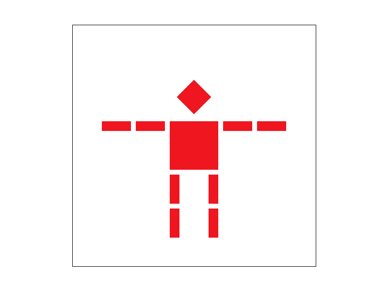

# CS 184/284A: Computer Graphics and Imaging, Spring 2024
# Homework 1: Rasterizer
## Edward Park
### [cal-cs184-student.github.io/hw-webpages-sp24-epark272/hw1](https://cal-cs184-student.github.io/hw-webpages-sp24-epark272/hw1/index.html)
<!-- ### [graphics.edwardpark.org](https://graphics.edwardpark.org) -->

## Overview
In this homework, I implemented a rasterizer that is able to support texturing, and which has a variety of antialiasing techniques. These techniques ranged from supersampling with different sampling techniques for the geometry drawn, to different pixel or level sampling methods for the interpolation of texture maps onto the drawn geometry. Being able to toggle these techniques on and off, and comparing the effects that each technique provides, is really useful for learning what each does.

Throughout this homework, I've learned a lot about the pipeline from sampling to a sample buffer to the frame buffer. I've also learned how to calculate barycentric coordinates. One thing that I can carry forward is my newfound knowledge and familiarity with svgs, which I intend to use a lot more than jpgs/pngs in the future. Finally, I was able to explore (even if for a little bit) the vast depth of graphics techniques that have been developed over the years, which really excited me to see.

## Section I: Rasterization
### Part 1: Rasterizing single-color triangles

My process of rasterizing a triangle is as follows:
1. I perform a vector cross product to determine if the vertices are wound in a clockwise direction. If they are not, I swap 2 vertices to ensure that the triangle is wound clockwise.
2. I calculate a bounding rectangle of the triangle using the vertices.
3. I sample at the middle of each pixel inside the bounding rectangle. Using that point, I perform 3 line tests to see if the point is inside the triangle.
4. If the sample is in the triangle, I call `RasterizeImp::fill_pixel`, which fills the sample buffer with the corresponding color.

My algorithm is no worse than checking each sample within the bounding box of the triangle because that is exactly the algorithm I used -- so it should perform similarly.

Here are a few examples of the rendered images:
| File | Image |
|:---:|:---:|
| svg/basic/test4.svg |  |
| svg/basic/test5.svg |  |

#### Extra credit: Optimizations

I performed 2 optimization on the triangle vertex bounding box. The first is to factor out redundant arithmetic operations out of for loops and equations. The second was to perform a column-wise check if we had already seen filled pixels, and if so, then cull the rest of the pixels, even if they are within the bounding box. However, I ran into some issues where very skinny and tall triangles would leave gaps in a column of pixels, causing my algorithm to incorrectly cull some pixels and leave some artifacts. I combated this by preventing culling from happening if I detected that the triangle had 2 steep (slope > 1) edges, at the expense of some performance.

#### Timing: Optimizations (average 10 times, ms)
| File | Naive | Factoring redundant arithmetic operations | Bounding box optimizations | Both optimizations |
|:---:|:---:|:---:|:---:|:---:| 
| svg/basic/test3.svg | 8.054 | 7.760 | 7.331 | 7.049 |
| svg/basic/test4.svg | 0.350 | 0.322 | 0.348 | 0.319 |
| svg/basic/test5.svg | 1.044 | 1.004 | 0.885 | 0.839 |
| svg/basic/test6.svg | 0.659 | 0.611 | 0.539 | 0.508 |

After performing an optimization for reducing the amount of redundant arithmetic operations, there was only a small amount (< 10%) improvement. However, with both optimizations applied, I was able to achieve a 10-15% speedup over the naive implementation.

### Part 2: Antialiasing triangles

Supersampling is a useful tool for antialiasing images. It allows us to reduce jaggies and other aliasing effects by computing an average of samples across a pixel, instead of using a single sample for each pixel. This leads to smoother edges, particularly for skinny and narrow triangles.

For supersampling, much of the rasterization process is the same. However, there are a few key differences:
- When sampling each pixel, I calculated a grid of `sample_rate` points to sample from. I had to add this to my sample buffer, instead of directly calling `RasterizeImp::fill_pixel`.
- I had to modify `RasterizeImp::fill_pixel` to fill the sample buffer with `sample_rate` copies of the provided color. This is so that points and lines would continue to render properly.
- The sample buffer needed to be `sample_rate` times as large, so I updated `RasterizerImp::set_sample_rate` and `RasterizerImp::set_framebuffer_target` accordingly.
- I still needed to calculate the average color value of all the supersamples, which I did in `RasterizerImp::resolve_to_framebuffer`.

| Supersampling rate | Image |
|:---:|:---:|
| 1 |  |
| 4 |  |
| 9 |  |
| 16 |  |

The effect is particularly prominent on skinny triangles like shown above. The reasoning for that is due to the triangle test and how it interacts with samples. If there are relatively few supersamples (like one for each pixel), there is a large chance that a triangle could go through a pixel but not hit the sample point, causing the rendered image to have a white pixel at that point. On the other hand with many supersamples, the chances that a triangle misses all the samples inside the pixel are much smaller.

#### Extra credit: Alternative antialiasing methods

I implemented a jittering-based supersampling approach. The supersampling is still done on a gridlike structure (so not completely random), but each point is offset by some random amount, creating a pattern where the pixel is still covered relatively evenly, but is not necessarily sampled on a strict grid pattern.

Overall, I did not see any noticable improvement to the antialiasing effects, and in fact it produced some aliasing of its own due to the uneven nature of sampling along straight lines. The pictures below demonstrate some of the aliasing effects, which is particularly noticeable on the bottom edge of the blue triangle.

| Supersampling method | Image |
|:---:|:---:|
| Naive grid-based |  |
| Jittered |  |

### Part 3: Transforms

For this part, I made my robot act post as a `0` in the [Dancing Men Cipher](https://www.arthur-conan-doyle.com/index.php/Dancing_Men_Alphabet), which was initially conceived by Sir Arthan Conan Doyle in the Sherlock Holmes story "The Adventure of the Dancing Men". The original alphabet was incomplete and only contained 18 letters, but today there is a consensus on all 26 English letters and all 10 digits. A complete alphabet can be found [here](https://www.boxentriq.com/code-breaking/dancing-men-cipher).

| File | Image |
|:---:|:---:|
| svg/transforms/robot.svg |  |
| svg/transforms/my_robot.svg |  |

## Section II: Sampling
### Part 4: Barycentric coordinates

Barycentric coordinates are a coordinate system that allow you to define a point based on 3 nonlinear points, which allows you to address the entire 2D plane. More generally, for a $N$-dimensional coordinate space, you can define the space using $N + 1$ points, provided that no 3 points are colinear. In the case of a triangle, the parameters $\alpha$, $\beta$, and $\gamma$ act as "weights" for each point in terms of how close or far a given point is from each vertex.
$$v = \alpha A + \beta B + \gamma C$$

I calculated $\alpha$, $\beta$, and $\gamma$ using the line equation, as it gives you a value that is proportional to the distance from the line to the point. Using this, I can divide it by the distance from the line to the opposite vertex, to get the corresponding barycentric coordinates.

| File | Image |
|:---:|:---:|
| svg/basic/task7.svg |  |
| svg/basic/triangle.svg |  |

In one of the pictures above, I have created a triangle with one red, one green, and one blue vertex, with the colors interpolated in between. You can interpret the amount of red present in any given pixel as the $\alpha$ value, the amount of green present in any given pixel as the $\beta$ value, and the amount of blue present in any given pixel as the $\gamma$ value. As expected, the $\alpha$, $\beta$, and $\gamma$ values are closest to 1 near their corresponding vertices.

### Part 5: "Pixel sampling" for texture mapping

Pixel sampling is used for texture mapping. There are 2 methods of sampling that we implement in this assignment, which are nearest-neighbor and bilinear interpolation. Using this sample method, we would fill the sample buffer with the color provided to us by the mipmap sample, rather than a given or interpolated color.

For nearest-neighbor (`P_LINEAR`), I first calculated the texture space (u, v) coordinates from the barycentric coordinates. Using those, I was able to round the coordinates to the nearest `int` to get the relevant texel color to put into the sample buffer.

For bilinear interpolation (`P_LINEAR`), it was a bit more difficult to identify which 4 texels were surrounding the point. After accounting for 4 different cases depending on which quadrant of the texel the (u, v) point lies in, I would sample the texels, and linearly interpolate the top 2 and the bottom 2 texels. Then, I would linearly interpolate the 2 resulting values from the previous interpolations, and input that into the sample buffer.

To bring it all together, I filled in `Texture::sample` to call the right function depending on the type of pixel sampling used. I also initialized the `SampleParams` struct to provide the relevant info to the `Texture::sample` function.

| Supersampling rate | Pixel sampling method | Image |
|:---:|:---:|:---:|
| 1 | P_NEAREST |  |
| 1 | P_LINEAR |  |
| 16 | P_NEAREST |  |
| 16 | P_LINEAR |  |

For the supersampling rate of 1, the bilinear interpolation is has less color contrast between adjacent pixels, which is prominent in the arches of the Campanile. The shadows are overly harsh for both images, but even more so for `P_NEAREST`.

For the supersampling rate of 16, the difference is much harder to spot. However, the color continuity is still noticely better on `P_LINEAR` if you pixel peep, particularly around the border of the arches. The colors are more smooth and even.

It makes sense that there would be a large difference when the supersampling rate is low, because each pixel receives its texture mapping value from a single texel, which has a uniform value throughout. In contrast, for higher supersampling rates, there is interpolation happening between adjacent texel values, meaning the value is variable dependent on how close the sample is to the texel's center -- something that was not accounted for when `sample_rate` was 1.

### Part 6: "Level sampling" with mipmaps for texture mapping

Level sampling is another part of texture mapping, where we choose the resolution of the mipmap according to different sampling methods.

Much of the difficulty in implementing level sampling was populating the `SampleParams` struct, in particular `p_dx_uv` and `p_dy_uv`. Since these had to be the (u, v) coordinates of (x + 1, y) and (x, y + 1), respectively, I had to repeat a lot of work in calculating the barycentric coordinates and then calculating the texture space coordinates from there. I made small optimizations along the way, but I still think there might be room for more optimization.

Furthermore, I calculated the nearest mipmap level $D$ according to
$$D = \log_2{(\max(\sqrt{(\frac{du}{dx})^2 + (\frac{dv}{dx})^2}, \sqrt{(\frac{du}{dy})^2 + (\frac{dv}{dy})^2}))}$$
Finally, I updated `Texture::sample` to account for the 3 different types of level sampling, including doing some linear interpolation for `L_LINEAR`. One tricky case that popped up is for `L_NEAREST`, you must clamp $D$ to be a non-negative integer, since mipmaps aren't generated for negative levels.

Between the 3 sampling techniques of pixel sampling, level sampling, and supersampling, I think supersampling is by far the easiest to implement, at the expense of memory and speed. The antialiasing power is pretty decent for the amount of work put in. On the other hand, changing pixel sampling methods tend to make large differences when supersampling is not implemented, at a smaller memory cost. Combining both supersampling and bilinear interpolation for pixel sampling generally tends to produce a very good antialiased result. When adding on level sampling methods, particularly trilinear sampling, it can often produce a blur effect that can be undesirable. In other words, it is a little bit too aggressive in antialiasing, to the point of removing some of the image features. For this reason, trying to antialias with any and all possible methods seems to be not worth the resources (time and memory) spent, and instead we can compromise with a faster, more efficient antialiasing technique that still produces acceptable results.

| Pixel / Level | P_NEAREST | P_LINEAR |
|:---:|:---:|:---:|
| L_ZERO |  |  |
| L_NEAREST |  |  |
| L_LINEAR |  |  |

The images shown above are the [Irworobongdo](https://en.wikipedia.org/wiki/Irworobongdo), a traditional Korean folding screen painting associated with royalty. With `P_NEAREST` and `L_ZERO`, the texture is clearly very pixelated, with lots of contrast between adjacent pixels. With `P_NEAREST` and `L_NEAREST`, though, much of the detail on the gold triangle is smoothed out, as well as the detail on the mountains in the background. With `P_NEAREST` and `L_LINEAR`, it is almost too blurry, as the gold triangle has lost almost all detail, and the detail on the mountains is much less prominent.

With `P_LINEAR` and `L_ZERO`, there is less contrast that pops out compared to `P_NEAREST` and `L_ZERO`, but it still very much is has too much constrast in the details. The next image, `P_LINEAR` and `L_NEAREST` is a bit blurrier than I'd like, and `P_LIENAR` and `L_LINEAR` is even blurrier. If I had turned supersampling up to a sample rate of 16, the images would be even blurrier than they are now.

## Section III: Art Competition
### Part 7: Draw something interesting!

For the art competition, I decided to draw a fractal-like triangle, modeled off the [Penrose triangle](https://en.wikipedia.org/wiki/Penrose_triangle).

The `.svg` file can be found at [docs/competition.svg](./competition.svg), and the script I used to generate the image is found in [src/draw_competition.py](../src/draw_competition.py). The script's primary function is `write_svg`, which is responsible for calling all other functions and writing the resulting string to the svg file. From there, my main helper function is `draw_cube`, which can draw an isometric view of a cube with different colors for the top, left and right face. Furthermore, each face can be independently drawn or not drawn. These all append to a string that will be written at the end of `write_svg`.

Using the `draw_cube` helper function, I have a lot of loops calling `draw_cube`. I also have a few other helper functions for some of the repeating patterns (the smaller triangles) that appear multiple times, because I did not want to copy and paste my code a bunch of times. Finally, the resulting string, allong with all the necessary headers needed in the svg file.