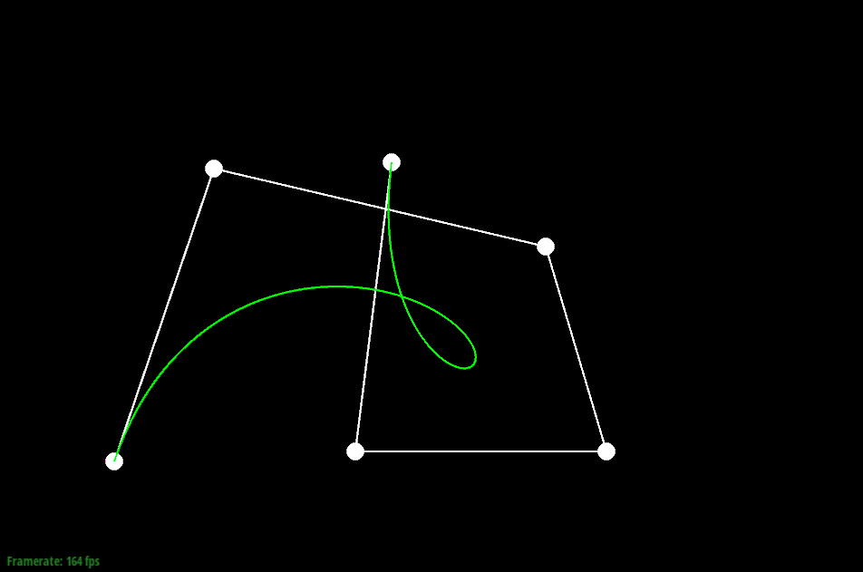
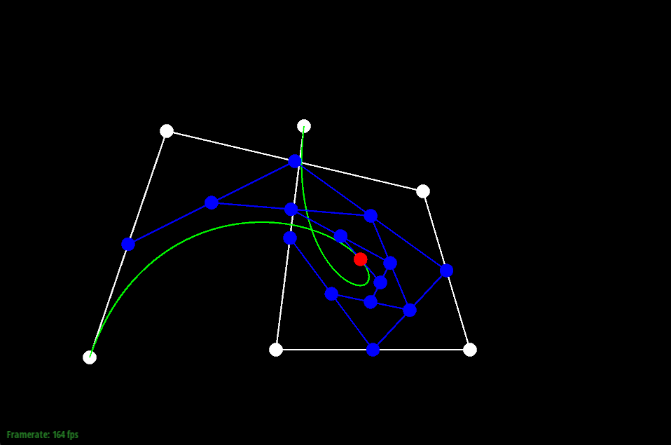

# CS 184/284A: Computer Graphics and Imaging, Spring 2024
# Homework 2: Meshedit
## Edward Park
### [cal-cs184-student.github.io/hw-webpages-sp24-epark272/hw2](https://cal-cs184-student.github.io/hw-webpages-sp24-epark272/hw2/index.html)
<!-- ### [graphics.edwardpark.org](https://graphics.edwardpark.org) -->

## Overview
In this homework, I implemented a tool for drawing and manipulating triangular meshes. This includes evaluating Bezier curves and surfaces using de Casteljau's algorithm iteratively. Using the provided GUI tools allowed me to visualize how Bezier curves are interpolated from the control points, giving me a deeper understanding of how de Casteljau's algorithm works.

In the second part of the homework, I used the halfedge data structure to manipulate triangle meshes. First, I implemented the calculation of area-weighted vertex normals, which is useful for applying Phong shading to a mesh to make it look smoother. On top of that, I implemented edge flipping and splitting, 2 operations which are crucial for the ultimate goal of mesh upsampling using the loop subdivision algorithm.

Along the way, I implemented a few extra credit features, mostly dealing with boundary cases in edge splitting and mesh upsampling. I also implemented a completely different mesh upsampling scheme. Seeing all the different subdivision schemes and reading the papers (including for the subdivision algorithms that I didn't implement such as Catmull-Clark and modified Butterfly) gave me an appreciation for the variety of different solutions that researches have come up with to solve the same problem. It also amazed me that many of the common algorithms use seemingly arbitrary weights when calculating updated vertex positions, empirically tested but not mathematically proven.

## Section I: Bezier Curves and Surfaces
### Part 1: Bezier curves with 1D de Casteljau subdivision
de Casteljau's algorithm is an algorithm to evaluate a Bezier curve from a set of control points. It relies on iterative linear interpolation between adjacent control points across a parameterized range $t \in [0, 1]$. The linear interpolation is calculated as follows: $$p_i^{'} = (1-t)p_i + tp_{i+1}$$

In part 1 of this homework, `BezierCurve::evaluateStep` only performs one step of de Casteljau's algorithm. The implementation consists of iterating from `0` to `points.size() - 1` (to avoid going out of bounds), and then pushing the linear interpolation result to a `vector<Vector2D>`. Here is an example Bezier curve with 6 control points.

For the rest of the images, I will show a series of images of a Bezier curve with 7 control points, since I already took all of the screenshots for it. Here is a sequence of de Casteljau's algorithms steps.

I can also move around the control points by dragging them, and modify the value of $t$ shown by scrolling. 

### Part 2: Bezier surfaces with separable 1D de Casteljau
de Casteljau's algorithm can be applied to Bezier surfaces as well! How it works is that there is a cage of control points, called a control cage. Then, along the rows of the control cage, we can use the 1D de Casteljau algorithm to evaluate a Bezier (control) curve for each parameter value $u$. Then, for each parameter value $v$ along the columns, you can use the de Casteljau algorithms to evaluate a Bezier curve along the control curve. This finally creates a Bezier surface.

I implemented this by filling in `BezierPatch::evaluateStep`, which in my implementation is exactly the same as `BezierCurve::evaluateStep`, with the exception of using `Vector3D` instead of `Vector2D`. Then, `BezierPatch::evaluate1D` iteratively calls `BezierPatch::evaluateStep` until there is 1 intermediate point left, which will be the final control point on each control curve for a given parameter $t$. The final step is to call `BezierPatch::evaluate1D` inside `BezierPatch::evaluate` with the passed-in parameter $u$, saving each of the intermediate values in a `vector<Vector3D>`, and finally call `BezierPatch::evaluate1D` on those intermediate values to evaluate it at parameter $v$.

Here is `bez/teapot.bez`, with and without wireframes:

## Section II: Triangle Meshes and Half-Edge Data Structure
### Part 3: Area-weighted vertex normals
The challenges with implementing this task was firstly understanding how to use the `Halfedge` data structure, and secondly how to calculate the area of the triangle.

For traversing the adjacent triangles around the vertex, I maintained a pointer to `h = halfedge()`, then called `h = h->twin()->next()` to move to the next triangle in a do-while loop. For each triangle face, I decided to calculate the area by using the following formula: $$A = \frac{||u \times v||}{2}$$

I calculated $u$ and $v$ by getting the vector difference between the vertices and the input vertex. Then, calculating the area of the triangle by taking the norm of the cross product and dividing by 2, I multiplied that value by the triangle face's normal vertex, and added that to the result. The final step is take the unit vector that corresponds to the vertex normal.

Using the vertex normals, we can implement Phong shading, which is a smoother way of getting shading, as it interpolates normal vectors across each triangle according to its vertex normals. This is in contrast with flat shading, which merely uses the face normal. Here is a comparison for `dae/teapot.dae`:

### Part 4: Edge flip
For the edge flip operation, I drew out all the halfedges, edges, vertices, and faces that are relevant for an edge flip. Then, I drew out a diagram of how each mesh element changes. Below on the left side, we see the mesh before an edge flip happens. On the right side, we see the mesh after we flip edge `e0`.

<table style="border: none;">
<tr style="border: none;">
<td style="border: white;">

</td>
<td style="border: white;">$\xrightarrow{\texttt{flipEdge(e0)}}$</td>
<td style="border: white;">

</td>
</tr>
</table>

For the implementation, I created a pointer to all the different halfedge, vertex, edge, and face elements that correspond to the adjacent faces of `e0`. For each halfedge, I reassigned all attributes: `next()`, `twin()`, `vertex()`, `edge()`, and `face()`, setting them to the relevant mesh element in the flipped version. I chose to not use the `Halfedge::setNeighbors()` function because I wanted to eventually delete all redundant assignments. Furthermore, for each vertex, edge, and face, I assigned the `halfedge()` attribute. After verifying that my implementation was correct, I would go back and delete all extraneous assignments.

For a demonstration of some of the edge flips, I used `dae/quadball.dae`. On the left side is the original mesh, and on the right side is the mesh with many edges flipped.

For this task, I didn't really experience any eventful debugging journeys. I think the reason I was able to avoid it was because of my implementation method, in which I reassigned all attributes before deleting the ones I did not need. Furthermore, I drew out the mesh and how it changed before implementing this task, solidifying my conceptual understanding of what I needed to do before writing any code.

### Part 5: Edge split
My approach for implementing the edge split operation was very similar to my approach for the edge flip operation. My first step was to draw out the diagram to visualize how each mesh element changes. Below is the diagram that I based my implementation on.

<table style="border: none;">
<tr style="border: none;">
<td style="border: white;">

</td>
<td style="border: white;">$\xrightarrow{\texttt{splitEdge(e0)}}$</td>
<td style="border: white;">

</td>
</tr>
</table>

Again, like the edge flip, I created pointers to all the relevant mesh elements in the adjacent faces to `e0`, setting `next()`, `twin()`, `vertex()`, `edge()`, and `face()` for each halfedge and `halfedge()` for each vertex, edge, and face. After verifying that my implementation was correct, I deleted all the redundant assignments.

Below, I show the mesh `dae/cube.dae` before and after edge splits are performed. On the left side is the original mesh, and on the right side is the mesh after a bunch of splits.

I also show `dae/torus/input.dae` through a series of flips and splits.

<table style="border: none;">
<tr style="border: none;">
<td style="border: white;">

</td>
<td style="border: white;">$\xrightarrow{flip}$</td>
<td style="border: white;">

</td>
<td style="border: white;">$\xrightarrow{split}$</td>
</tr>
<tr style="border: none;">
<td style="border: white;">

</td>
<td style="border: white;">$\xrightarrow{flip}$</td>
<td style="border: white;">

</td>
<td style="border: white;">$\xrightarrow{split}$</td>
</tr>
<tr style="border: none;">
<td style="border: white;">

</td>
</tr>
</table>

Much like the previous task, I did not really experience much debugging, once again thanks to my meticulousness in implementing the reassignments correctly before deleting extraneous ones, as well as my solid conceptual understanding of how all mesh elements change.

#### Extra credit: Support edge splits for boundary edges
I implemented edge splits for boundary edges. The first thing I did was to draw out a diagram of how the mesh elements changed for a boundary split. I have the diagram below, where on the left side is the mesh before the boundary split happens. The dark face, `f1`, represents the boundary face, which is not necessarily a triangle face. After the split happens, the mesh gets transformed to the right side, where notable the exterior halfedge `h3` gets split into `h3` and `h6`.

<table style="border: none;">
<tr style="border: none;">
<td style="border: white;">

</td>
<td style="border: white;">$\xrightarrow{\texttt{splitBoundaryEdge(e0)}}$</td>
<td style="border: white;">

</td>
</tr>
</table>

For the implementation, I defined a new function called `HalfedgeMesh::splitBoundaryEdge`, which I had to declare in `student_code.h`. The function had one parameter, `EdgeIter e0`. However, I couldn't be sure that `e0->halfedge()` would point to the internal halfedge `h0`. Thus, before reassigning any pointers, I checked if `h0->isBoundary()`, and if it was, I set `h0 = h0->twin()` so that `h0` was the internal halfedge and `h3` was the external halfedge. This was made on the assumption that an edge cannot be surrounded by 2 adjacent boundary faces. Finally, in `HalfedgeMesh::splitEdge`, if the passed-in `e0` was on a boundary, I called `HalfedgeMesh::splitBoundaryEdge` instead.

To demonstrate the boundary edges working properly, I used `dae/beetle.dae` and split all the boundary edges around a window. Then, I split those boundary edges to show that all the pointers were assigned properly and did not break after one split. You can see the original mesh and the mesh with split boundaries below.

During the implementation, I ran into a bug with the order in which I was assigning `h3->next()` and `h6->next()`. I was able to identify and resolve this bug, however, by clicking on the mesh and observing that `h6->next()` was `h6`. I fixed this by maintaining a pointer to `h3Next = h3->next()` before reassigning `h3->next()`, then assigning `h6->next() = h3Next`. Fixing this bug made my implementation work properly. 

### Part 6: Loop subdivision for mesh upsampling
Implementing loop subdivision was the hardest part of this homework to implement. The overall logic was laid out for me in the comments of `MeshResampler::upsample` and the spec:
1. Compute the updated old vertex positions, storing them in `v->newPosition`. The calculation is done by $$\texttt{v->newPosition} = (1 - nu) \times \texttt{v->position} + u \sum_{i=0}^{n-1}\texttt{neighbor}_i\texttt{->position}$$ where $n$ is the degree of $v$ and $u = \begin{cases} \frac{3}{16} & n = 3 \\ \frac{3}{8n} & n \neq 3 \end{cases}$
2. Compute the new vertex positions, storing them in `e->newPosition`. This calculation is done by $$\begin{align*} \texttt{e->newPosition} =& \frac{3}{8} \texttt{(sum of e's vertex positions)} \\& + \frac{1}{8} \texttt{(sum of the opposite vertex positions for e's adjacent faces)} \end{align*}$$
3. Split every edge in the mesh by calling `HalfedgeMesh::splitEdge`. After splitting, make sure to set the new vertex positions by setting $$\texttt{v->newPosition} = \texttt{e->newPosition}$$
4. Flip any new edge in the mesh that connects an old and a new vertex by calling `HalfedgeMesh::flipEdge`
5. Update all vertex positions via $$\texttt{v->position} = \texttt{v->newPosition}$$

I ran into a fair bit of trouble implementing this task, of which the most significant was that I was overflipping edges in step 4. I was flipping all edges that connect an old and a new vertex, instead of only flipping the new edges that satisfy the criteria. However, thanks to the staff and other students on Ed, I was able to find someone who had a similar output to me, and apply the suggested changes.

Below, I showcase `dae/cube.dae` at different levels of mesh upsampling. The sharp corners and edges of the cube becomes much more rounded, as well as asymmetrical. Furthermore, it reduces in size for each upsample, though this effect becomes smaller as the number of iterations increases (as it approaches the limit surface). At the end, the mesh becomes pretty unrecognizable as a cube.

In the below diagrams, I fulfill both of the following 2 requirements for the writeup:
- Reduce the rounding effect for sharp corners and edges by pre-splitting some edges
- Pre-process the cube with edge flips and splits so that the cube subdivides symmetrically

I pre-processed the cube with edge flips and splits symmetrically such that the cube is now symmetric. You can see the initial pre-processing in the first image, as well as what happens when I upsample in the following images.

Pre-processing the cube made a huge difference to the overall outcome. Firstly, the symmetrical design of the cube mesh prevented it from becoming asymmetric. Secondly, by splitting the edges into smaller edges, the cube was able to maintain a much more similar shape to the original mesh. After 4 mesh upsamples, the mesh was still identifiable as a cube, something that was not possible in the non-preprocessed version.

The reason that asymmetric meshes resulted in an asymmetric limit surface is due to the way the old vertex positions are calculated. Specifically, in the case of the cube, the distance between vertices of diagonal edges that cut across a cube face are $\sqrt{2}$ times longer than the distance between vertices of edges that form the edges of the cube. This essentially results in an effect where vertices a higher degree gets pulled into the center more than vertices with a lower degree, causing the asymmetry. By pre-processing the mesh to be symmetric before any upsampling occurs, I make all symmetrically equivalent vertices have the same degree, meaning it gets affected equally.

As for the pre-processing step of splitting edges, this reduced the rounding effect of sharp corners and edges simply because the average of the adjacent vertices is closer to the original position of the vertex, due to the adjacent vertices being closer to the original position of the vertex. This allows vertices on a sharp corner or edge to keep closer to its original position.

#### Extra credit: Support meshes with boundary
I implemented mesh upsampling with boundary edges. I did not have to implement too many changes to `HalfedgeMesh::upsample`. The relevant changes occured in steps 2 and 3, where:
1. If `v->isBoundary()`, the old vertex positions are updated with $$\texttt{v->newPosition} = \frac{3}{4} \times \texttt{v->position} + \frac{1}{8} \texttt{(sum of v's adjacent boundary vertices)}$$
2. If `e->isBoundary()`, I calculated the new vertex positions `e->position` by doing $$\texttt{e->newPosition} = \frac{1}{2} \texttt{(sum of e's vertex positions)}$$

The rest of the `HalfedgeMesh::upsample` function stays the same.

I did encounter some subtle bugs while implementing this feature. Notably, on the [B-pillar](https://en.wikipedia.org/wiki/Pillar_(car)) of the beetle, I calculated the wrong old vertex positions because I was adding all adjacent vertices that were on a boundary. Instead, I needed to add all vertices attached to adjacent boundary edges. Making this change ensured that the B-pillar of the beetle rendered properly.

#### Extra credit: Implement additional subdivision schemes
For the extra credit additional subdivision scheme, I decided to implement [$\sqrt{3}$-Subdivision](https://www.graphics.rwth-aachen.de/media/papers/sqrt31.pdf). The idea behind this subdivision scheme is that you insert a vertex into the middle of a triangular face, and connect the new vertex with the vertices of the triangle. Then, it flips all old edges.

As with all my other implementations, I first drew out a diagram of what mesh elements were added and modified:

<table style="border: none;">
<tr style="border: none;">
<td style="border: white;">

</td>
<td style="border: white;">$\xrightarrow{\texttt{triadicSplit(f0)}}$</td>
<td style="border: white;">

</td>
</tr>
</table>

For the actual implementation, I defined a new function in `student_code.h` called `HalfedgeMesh::triadicSplit`, and then implemented it in `student_code.cpp`. Notably, this function has a parameter of `FaceIter f0`, as opposed to the other split/flip functions which takes in `EdgeIter e0` as the parameter. Additionally, I added a new `bool isNew` attribute to `Face`.

Then in `MeshResampler::upsample`, I did the following:
1. Comment out all code relating to loop subdivision
2. Iterate through all faces, edges, and vertices in the mesh, setting their `isNew` attribute to `false`
3. Call `HalfedgeMesh::triadicSplit` on all faces. The position of the new vertex is calculated inside this function, with $$\texttt{v3->position} = \frac{1}{3} \sum_{i=0}^{2}\texttt{v}_i\texttt{->position}$$
4. Calculate updated old vertex positions, using $$\texttt{v->newPosition} = (1 - a_n) \times \texttt{v->position} + a_n \frac{1}{n} \sum_{i=0}^{n-1}\texttt{neighbor}_i\texttt{->position}$$ where $n$ is the degree of $v$ and $a_n = \frac{4 - 2 \cos{\frac{2 \pi}{n}}}{9}$
5. Update all old vertex positions

Below I compare the results of the $\sqrt{3}$ subdivision scheme with loop subdivision. There are a few notable differences. First, on odd mesh upsampling levels the mesh is rotated, and on even mesh upsampling levels the mesh mirrors the original mesh structure. Additionally, if you look at the 2nd upsampling level, there appears to be far more faces in the loop subdivision scheme than the $\sqrt{3}$ subdivision scheme. This is because loop subdivision performs a 4-to-1 split, whereas $\sqrt{3}$ subdivision performs a 3-to-1 split. This means that $\sqrt{3}$ subdivision grows slower than loop subdivision, which has both pros and cons; you can subdivide for more iterations given the same computational power, but each iteration will have exponentially less faces. Finally, it's worth noting that this algorithm was much simpler to understand and implement than loop subdivision.

| Loop Subdivision | $\sqrt{3}$ Subdivision |
|:---:|:---:|
|  |  |
|  |  |
|  |  |

There was only a small bit of difficulty in implementing this task. Namely, when splitting the faces into thirds, I could not figure out a good way of iterating through the faces without causing an infinite loop. I solved this problem by instead iterating over the edges, splitting each adjacent face only if the face was not new.

## Section III: Art Competition
### Part 7: Draw something interesting!

Perhaps I will create something in Blender for extra credit, if I have energy.
