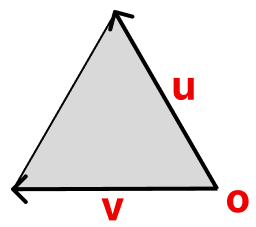
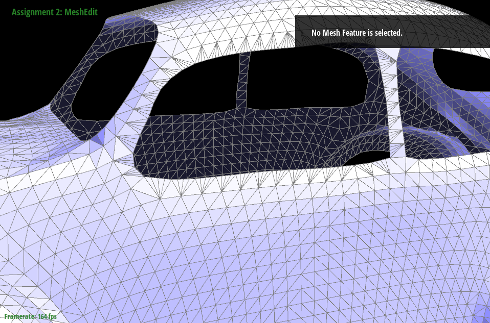

# CS 184/284A: Computer Graphics and Imaging, Spring 2024
# Homework 2: Meshedit
## Edward Park
### [cal-cs184-student.github.io/hw-webpages-sp24-epark272/hw2](https://cal-cs184-student.github.io/hw-webpages-sp24-epark272/hw2/index.html)
<!-- ### [graphics.edwardpark.org](https://graphics.edwardpark.org) -->

## Overview
TODO

## Section I: Bezier Curves and Surfaces
### Part 1: Bezier curves with 1D de Casteljau subdivision
de Casteljau's algorithm is an algorithm to evaluate a Bezier curve from a set of control points. It relies on iterative linear interpolation between adjacent control points across a parameterized range $t \in [0, 1]$. The linear interpolation is calculated as follows: $$p_i^{'} = (1-t)p_i + tp_{i+1}$$

In part 1 of this homework, `BezierCurve::evaluateStep` only performs one step of de Casteljau's algorithm. Here is an example Bezier curve with 6 control points.

For the rest of the images, I will show a series of images of a Bezier curve with 7 control points, since I already took all of the screenshots for it. Here is a sequence of de Casteljau's algorithms steps.

I can also move around the control points by dragging them, and modify the value of $t$ shown by scrolling. 

### Part 2: Bezier surfaces with separable 1D de Casteljau
de Casteljau's algorithm can be applied to Bezier surfaces as well! How it works is that there is a cage of control points, called a control cage. Then, along the rows of the control cage, we can use the 1D de Casteljau algorithm to evaluate a Bezier (control) curve for each parameter value $u$. Then, for each parameter value $v$ along the columns, you can use the de Casteljau algorithms to evaluate a Bezier curve along the control curve. This finally creates a Bezier surface.

I implemented this by filling in `BezierPatch::evaluateStep`, which in my implementation is exactly the same as `BezierCurve::evaluateStep`, with the exception of using `Vector3D` instead of `Vector2D`. Then, `BezierPatch::evaluate1D` iteratively calls `BezierPatch::evaluateStep` until there is 1 intermediate point left, which will be the final control point on each control curve for a given parameter $t$. The final step is to call `BezierPatch::evaluate1D` inside `BezierPatch::evaluate` with the passed-in parameter $u$, saving each of the intermediate values in a `vector<Vector3D>`, and finally call `BezierPatch::evaluate1D` on those intermediate values to evaluate it at parameter $v$.

Here is `bez/teapot.bez`, with and without wireframes:

## Section II: Triangle Meshes and Half-Edge Data Structure
### Part 3: Area-weighted vertex normals
The challenges with implementing this task was firstly understanding how to use the `Halfedge` data structure, and secondly how to calculate the area of the triangle.

For traversing the adjacent triangles around the vertex, I maintained a pointer to `h = halfedge()`, then called `h = h->twin()->next()` to move to the next triangle in a do-while loop. For each triangle face, I decided to calculate the area by using the following formula: $$A = \frac{||u \times v||}{2}$$

I calculated $u$ and $v$ by getting the vector difference between the vertices and the input vertex. Then, calculating the area of the triangle by taking the norm of the cross product and dividing by 2, I multiplied that value by the triangle face's normal vertex, and added that to the result. The final step is take the unit vector that corresponds to the vertex normal.

Using the vertex normals, we can implement Phong shading, which is a smoother way of getting shading, as it interpolates normal vectors across each triangle according to its vertex normals. This is in contrast with flat shading, which merely uses the face normal. Here is a comparison for `dae/teapot.dae`:

### Part 4: Edge flip
For the edge flip operation, I drew out all the halfedges, edges, vertices, and faces that are relevant for an edge flip. Then, I drew out a diagram of how each mesh element changes. Below on the left side, we see the mesh before an edge flip happens. On the right side, we see the mesh after we flip edge h0.

<table style="border: none;">
<tr style="border: none;">
<td style="border: white">

</td>
<td style="border: white">$\xrightarrow{flip(h0)}$</td>
<td style="border: white">

</td>
</tr>
</table>

For the implementation, I created a pointer to all the different halfedge, vertex, edge, and face elements that correspond to the halfedge `h0`. For each halfedge, I reassigned all attributes: `next()`, `twin()`, `vertex()`, `edge()`, and `face()`, setting them to the relevant mesh element in the flipped version. I chose to not use the `Halfedge::setNeighbors()` function because I wanted to eventually delete all redundant assignments. Furthermore, for each vertex, edge, and face, I assigned the `halfedge()` attribute. After verifying that my implementation was correct, I would go back and delete all extraneous assignments.

For a demonstration of some of the edge flips, I used `dae/quadball.dae`. On the left side is the original mesh, and on the right side is the mesh with many edges flipped.

For this task, I didn't really experience any eventful debugging journeys. I think the reason I was able to avoid it was because of my implementation method, in which I reassigned all attributes before deleting the ones I did not need. Furthermore, I drew out the mesh and how it changed before implementing this task, solidifying my conceptual understanding of what I needed to do before writing any code.

### Part 5: Edge split
TODO

#### Extra credit: Support edge splits for boundary edges
TODO

### Part 6: Loop subdivision for mesh upsampling
TODO

#### Extra credit: Support meshes with boundary
TODO show boundary mesh division

#### Extra credit: Implement additional subdivision schemes
TODO show triadic mesh division

| Loop Subdivision | $\sqrt{3}$ Subdivision |
|:---:|:---:|
|  |  |
|  |  |
|  |  |

## Section III: Art Competition
### Part 7: Draw something interesting!
